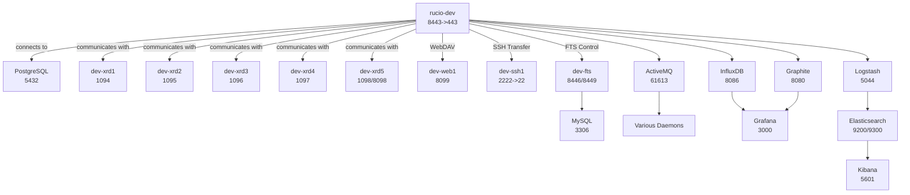

# architecture-docs

## Summary

This repository contains unofficial architecture documentation on the Rucio project.
Its primary goal is to provide a minimal and focused understanding of the system (building blocks, communication between components and systems, relevant cross-cutting concepts, etc.). It is intended as a lightweight reference to support personal comprehension and quick lookup, rather than as a comprehensive or authoritative source.

## References

- [What is Rucio?](https://rucio.github.io/documentation/started/what_is_rucio)
- [Rucio daemons](https://rucio.github.io/documentation/started/main_components/daemons)
- [Rucio Project Structure](https://rucio.github.io/documentation/developer/project_structure)
- [arc42 overview](https://arc42.org/overview)
- [Markdown Architectural Decision Records](https://adr.github.io/madr/)

## arc42 chapters

TODO(mgajek-cern): Eventually setup Jekyll based project or use other static site generator tool 

### 1. Introduction and Goals

See [What is Rucio?](https://rucio.github.io/documentation/started/what_is_rucio)

### 2. Constraints

[Overview of constraints influencing the architecture can be found here](./2-constraints/architecture-constraints.md)

### 3. Context & Scope

| Name | Type | Description |
| --- | --- | --- |
| Rucio | Internal System | Scientific data management framework providing declarative policy-based data organization, transfer, and lifecycle management across distributed heterogeneous storage infrastructure |
| ~~Workflow Management Systems~~ | ~~External System~~ | ~~Job and task orchestration platforms that coordinate with Rucio for data availability, requesting datasets at specific locations and registering job outputs for lifecycle management~~ |
| Authentication Systems | External System | Identity and access management services providing user authentication and authorization through various protocols and credential mechanisms |
| Storage Systems | External System | Heterogeneous storage backends including traditional filesystems, object storage, tape archives, and cloud storage accessed through standardized protocols |
| Monitoring Systems | External System | Analytics and observability platforms that collect, process, and visualize system performance metrics, usage statistics, and operational health data |
| Logging Systems | External System | Centralized logging infrastructure that aggregates, stores, and provides search capabilities for system events, audit trails, and troubleshooting information |
| Database Systems | External System | Transactional relational database management systems that serve as the persistence layer for catalog metadata, system state, and configuration data |
| Transfer Systems | External System | Data movement services and protocols that handle the physical transfer of files between storage endpoints with reliability, scheduling, and error handling capabilities |
| Messaging Systems | External System      | Messaging services that enable asynchronous communication between distributed components, supporting event-driven architectures, decoupling, and reliable message delivery. |
| Caching Systems | External System      | High-speed data stores that temporarily hold frequently accessed data to reduce latency, decrease load on primary data sources, and improve overall system performance. |

---

[Stakeholder details are provided here](./3-scope-and-context/stakeholders.md)

### 4. Solution strategy

TODO(mgajek-cern): Add links if existing

### 5. Building Block views

#### Lvl 1

**Workflow Pattern:**

1. *User/Client* → *REST API*: "Create replication rule: 3 copies on different continents"
2. *REST API* → *Database*: Records the rule as a database entry
3. *Daemons* → *Database*: Query for pending rules/tasks
4. *Daemons* → *Storage/Transfer systems*: Execute the actual data operations
5. *Daemons* → *Database*: Update completion status

#### Lvl 2

See also: [Rucio Project Structure](https://rucio.github.io/documentation/developer/project_structure)

#### Lvl 3

##### Daemons

TODO(mgajek-cern): Decomposition

[For more information on Rucio daemons refer to](https://rucio.github.io/documentation/started/main_components/daemons)

### 6. Runtime view

TODO(mgajek-cern): Add links if existing

### 7. Deployment view

*To be defined with stakeholders, example below*

As of now, the system distinguishes between development and production environments. However, introducing a dedicated quality assurance (QA) environment could also be beneficial for testing changes in an isolated setting before promoting them to production.

#### Development environment - Single Node (docker-compose)

For additional information, refer to the [Using the Standard Environment](https://rucio.github.io/documentation/operator/setting_up_demo#using-the-standard-environment) section and subsequent sections.

#### Development and Production environments - Multi-Node (Kubernetes)

TODO(mgajek-cern): add diagram, links, some content

#### Production environments - Multi-Site (Kubernetes Federation)

TODO(mgajek-cern): add diagram, links, some content

### 8. Crosscutting concepts

Refer to [Accounting and quota web page](https://rucio.github.io/documentation/started/concepts/accounting_and_quota) and subsequent sections.

### 9. Architectural decisions

TODO(mgajek-cern): Dedicated folder with .md content and add links if existing

### 10. Quality requirements

[Overview of quality requirements can be found here](./10-quality-requirements/quality-requirements.md)

### 11. Risks & technical debt

TODO(mgajek-cern): Add links if existing

### 12. Glossary

TODO(mgajek-cern): Add links if existing

